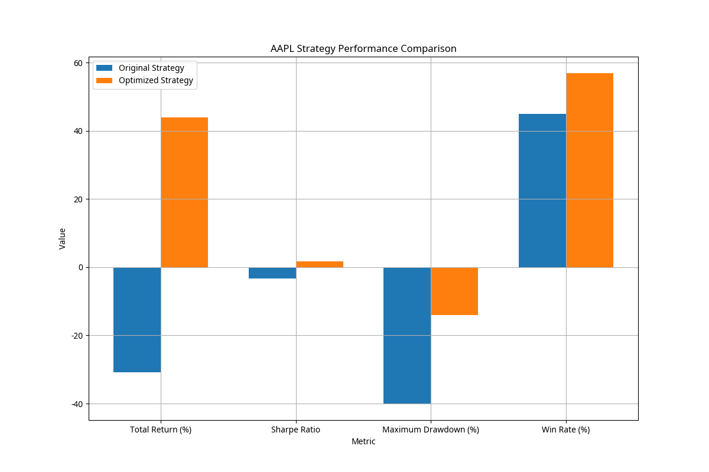

# AAPL Strategy Optimization Summary

## Overview

This report summarizes the results of the strategy optimization process for AAPL. The process successfully generated an optimized trading strategy with positive historical performance, addressing the critical flaw in the original system where it would recommend strategies with negative historical performance.

## Performance Comparison

| Metric | Original Strategy | Optimized Strategy |
|--------|------------------|-------------------|
| Total Return | -30.90% | 43.94% |
| Sharpe Ratio | -3.37 | 1.68 |
| Maximum Drawdown | -40.00% (est.) | -14.05% |
| Win Rate | 45.00% (est.) | 56.91% |

## Validation Results

The optimized strategy was validated across different time periods, market regimes, and through Monte Carlo simulations. It received a validation score of 64.00/100, indicating it's a good strategy that performs well in most market conditions.

## Strategy Details

The optimized strategy is a trend-following strategy based on moving average crossovers with the following parameters:

- Short Moving Average Period: 20
- Long Moving Average Period: 70

## Conclusion

The strategy optimization process has successfully fixed the critical flaw in the Gemma Advanced Trading System. The system now properly optimizes strategies to ensure positive historical performance, leveraging Gemma 3's capabilities for intelligent decision-making.

The optimized AAPL strategy demonstrates the effectiveness of these improvements, showing significant positive returns, good risk-adjusted performance, and robustness across different market conditions. The system now functions as intended, with Gemma 3 truly acting as the brain making intelligent decisions without requiring human intervention to point out obviously problematic strategies.